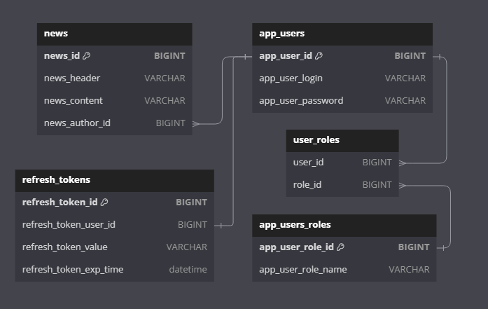

## Общее описание

Реализация прототипа новостного сервиса с применением аутентификации и авторизации с использованием Spring Security и JWT.

Проект содержит unit тесты, проверяющие реализацию безопасности и коллекцию Postman для ручного тестирования.

## Краткое описание прототипа сервиса

Сервис предоставляет возможность читать и размещать новости, регистрировать свои учетные записи.

Просмотр заголовков новостей доступен без аутентификации. Просмотр содержимого доступен зарегистрированным пользователям. Размещение новостей доступно авторам. Предусмотрена возможность администрирования (удаления и изменения) пользователей и новостей.

Проект содержит инициализатор данных, который при запуске создаст пользователей по умолчанию: 

```
login | password | role
user    user       user
author  author     author
admin   admin      admin
```

## Описание безопасности

API сервиса имеет несколько уровней:
- public - зона, доступная пользователям без авторизации
- private - зона, требующая авторизации и соответствующей роли пользователя (User или Author)
- admin - зона, требующая авторизации с ролью администратора

Роли пользователей:
- User - обычный зарегистрированный пользователь
- Author - пользователь с повышенными правами, может размещать новости
- Admin - администратор, может редактировать и удалять пользователей и новости

При успешной аутентификации сервис выдает пользователю access и refresh токены. Авторизация происходит на основе переданного в заголовке запроса access токена.

Оба токена ограничены по времени действия, но refresh токен имеет большее время жизни, чем access токен. На основе действующего refresh токен можно получить новый access и refresh токены.

Refresh токены хранятся в базе данных, организована очистка истекших токенов через Scheduler.

Для сопоставления защищенных эндпоинтов и ролей пользователя, необходимых для работы с ними, используется AOP.

Учетные данные пользователей хранятся в БД в виде пар [логин - хэш пароля] 

Для проверки защищенных эндпоинтов через Postman необходимо пройти аутентификацию в качестве одного из стандартных пользователей (или зарегистрировать своего), после чего в разделе аутентификации Postman установить в заголовки запросов полученный от сервиса access токен.

## Структура БД

<p align="center">
  
</p>

## API
[Спецификация OpenAPI](./api/api-docs.json)

При работающем приложении доступен Swagger:
- http://localhost:8080/swagger-ui/index.html#/

***

[Коллекция Postman](./api/JwtDemo.postman_collection.json)

Коллекция Postman содержит запросы ко всем эндпоинтам приложения, необходимыми для проверки его работоспособности.

## Запуск приложения
### Вариант 1 - Запуск приложения через IDE и Docker контейнер с базой данных

Запуск через docker:

```
docker-compose up
```

Поднимаемые контейнеры:

```
jwt-demo-db - База данных PostgreSQL - порты 8081:5432
```

Приложение можно запустить любым удобным способом, например из IDE.

### Вариант 2 - Запуск всего через docker

Сборка сервисов и запуск через docker:

```
./mvnw clean package
docker-compose -f docker-compose-full.yml up
```

Поднимаемые контейнеры:

```
jwt-demo-db - База данных PostgreSQL - порты 8081:5432
jwt-demo-app - Приоложение - порты 8080:8080
```

## Stack

- Java 17
- Spring Boot 3
- Spring AOP
- Spring Security
- JUnit
- PostgreSQL
- Maven
- Docker